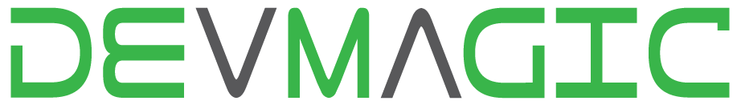

# Desafio Técnico para Desenvolvedor Ruby

Orientações gerais:

- prazo limite para resolução do desafio é de 24 horas a partir do recebimento
- sua resolução deve ser enviada na forma de um _pull request_ para este repositório
- as questões teóricas podem ser respondidas no próprio arquivo _readme_ do repositório
- testes não são obrigatórios, porém um grande diferencial
- atenção para a organização das resoluções (o versionamento será levado em consideração)
- qualquer dúvida não hesite em entrar em contato

###  Desafio 1

O que esta expressão retorna e por quê?

`true and 0 && !nil and 3 > 2`

A expressão retorna `true`. A primeira parte da expressão possui dois valores, que quando comparados retornam `true`. Apesar do segundo valor da primeira expressão ser `0`, ele é um valor valido que no ruby é avaliado como `true`(Apenas seria avalido como falso se o valor fosse `false` ou `nil`). Já na primeira parte da segunda expressão `nil` é negado caracterizando-a como verdadeira e posteriormente o resultado da expressão `3>2` também é verdadeiro. Logo toda a expressão é verdadeira.

### Desafio 2

Explique o funcionamento do operador _Or Equals_

`a ||= b`

### Desafio 3

Escreva um programa que imprima os números de 1 até 100 substituindo os múltiplos de 3 pela palavra _Dev_, os múltiplos de 5 pela palavra _Magic_ e os múltiplos de ambos pela palavra _DevMagic_

### Desafio 4

Escreva um programa que verifica se uma dada sentença é um palíndromo

### Desafio 5

Escreva um programa que converta um número inteiro para uma string

> &quot;You should name a variable using the same care with which you name a first-born child.&quot; Robert C. Martin
